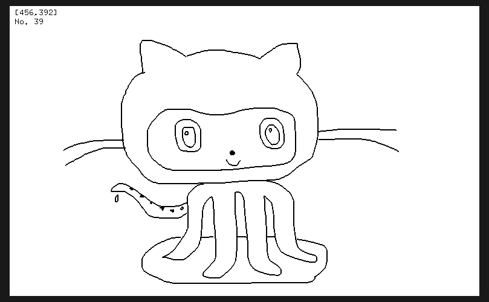

# Grapha

Vim-like paint application powered by GLUT(openGL Utility Toolkit, C-lang 3D CG API) for Linux or Mac.

## Building

```bash:bash
$ git clone https://github.com/AhmedMostafa16/Grapha.git
$ cd Grapha
$ mkdir build && cd ./build
$ cmake ..
$ make
```

## Tutorials

Go to directory where "Grapha" executable exists ("build" directory).      
Then, execute Grapha with "file.gra" as an argument.

```bash:bash
$ ./Grapha file.gra
```

As another way, after starting Grapha, type ":" in Grapha window to start the console mode, and enter the following command,

```vim:Grapha consol
:edit file.gra
```

Grapha's command list can be confirmed by "help" command.

```vim:Grapha consol
:help
```

The command list is described in "./src/Command.cpp".

## Screenshots


